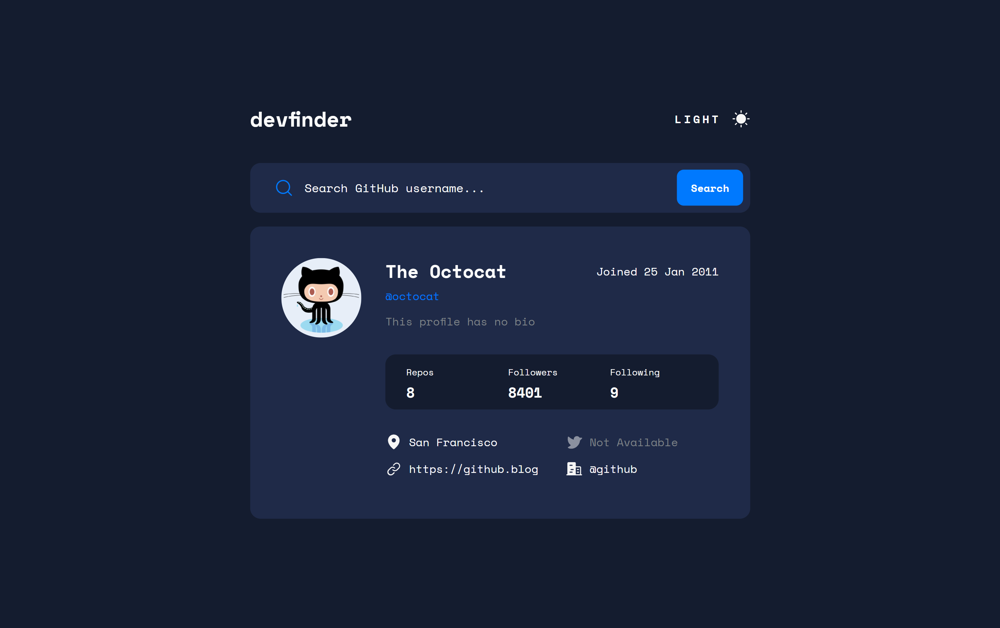

# Frontend Mentor - GitHub user search app Challenge solution

This is a solution to the [GitHub user search app challenge on Frontend Mentor](https://www.frontendmentor.io/challenges/github-user-search-app-Q09YOgaH6).

### The challenge

Users should be able to:

- View the optimal layout for the app depending on their device's screen size
- See hover states for all interactive elements on the page
- Search for GitHub users by their username
- See relevant user information based on their search
- Switch between light and dark themes
- Bonus: Have the correct color scheme chosen for them based on their computer preferences.

### Built with

- Semantic HTML5 markup
- CSS custom properties
- Flexbox
- CSS Grid
- Mobile-first workflow
- JavaScript
- Axios
- GitHub API

### Screenshot

### Links

- Solution URL: [GitHub](https://github.com/DorottyaB/github-user-search-app)
- Live Site URL: [on Netlify](https://superb-quokka-c395fc.netlify.app/)

## Author

- Website - [Dorottya](https://github.com/DorottyaB)
